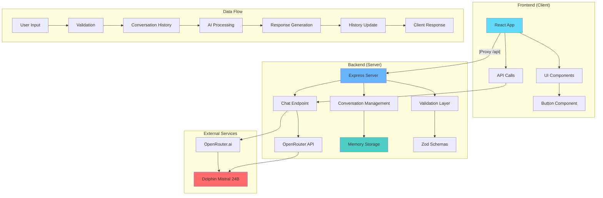

# 🤖 AppAI - Sistema de IA Sin Censura

Un sistema completo de inteligencia artificial sin limitaciones ni censura, construido con tecnologías modernas para conversaciones libres y sin restricciones.

## 🚀 Características Principales

- **IA Sin Censura**: Utiliza el modelo `dolphin-mistral-24b-venice-edition` conocido por su libertad de respuesta
- **Conversaciones Persistentes**: Sistema de gestión de conversaciones con historial completo
- **Arquitectura Moderna**: Monorepo con cliente React y servidor Express
- **API RESTful**: Endpoints completos para gestión de conversaciones
- **Interfaz Moderna**: UI construida con React, TailwindCSS y componentes de Radix UI
- **TypeScript**: Tipado fuerte en todo el proyecto
- **Validación Robusta**: Esquemas Zod para validación de datos

## 📊 Diagrama de Arquitectura



## 🗂️ Estructura del Proyecto

```
appai/
├── 📁 packages/
│   ├── 📁 client/           # Frontend React + Vite
│   │   ├── 📁 src/
│   │   │   ├── App.tsx      # Componente principal
│   │   │   ├── main.tsx     # Punto de entrada
│   │   │   └── 📁 components/ui/
│   │   │       └── button.tsx
│   │   ├── vite.config.ts   # Configuración Vite + Proxy
│   │   └── package.json
│   └── 📁 server/           # Backend Express + TypeScript
│       ├── index.ts         # Servidor principal
│       └── package.json
├── index.ts                 # Launcher concurrente
├── package.json             # Configuración workspace
└── README.md
```

## 🛠️ Tecnologías Utilizadas

### Backend

- **Express.js** - Framework web para Node.js
- **OpenAI SDK** - Cliente para APIs de IA
- **Zod** - Validación de esquemas TypeScript
- **dotenv** - Gestión de variables de entorno
- **TypeScript** - Tipado estático

### Frontend

- **React 19** - Biblioteca de interfaz de usuario
- **Vite** - Build tool y servidor de desarrollo
- **TailwindCSS** - Framework de estilos utilitarios
- **Radix UI** - Componentes primitivos accesibles
- **Lucide React** - Iconos modernos

### DevOps & Herramientas

- **Bun** - Runtime JavaScript rápido
- **Concurrently** - Ejecutor de comandos paralelos
- **Prettier** - Formateador de código
- **Husky** - Git hooks

## ⚙️ Variables de Entorno

Crea un archivo `.env` en la carpeta `packages/server/`:

```env
# API Key de OpenRouter para acceso al modelo Dolphin Mistral
OPENROUTER_API_KEY=tu_api_key_aqui

# Puerto del servidor (opcional, por defecto 3000)
PORT=3000
```

### 📝 Obtener API Key de OpenRouter

1. Visita [OpenRouter.ai](https://openrouter.ai)
2. Crea una cuenta gratuita
3. Ve a la sección "Keys" en tu dashboard
4. Genera una nueva API key
5. Copia la key en tu archivo `.env`

## 🚀 Instalación y Configuración

### Prerrequisitos

- **Bun** v1.0+ instalado
- **Node.js** v18+ (opcional, para npm/yarn)
- Cuenta en **OpenRouter.ai**

### Pasos de Instalación

1. **Clonar el repositorio**

```bash
git clone https://github.com/Lostovayne/Architecture-of-an-AI-app.git
cd appai
```

2. **Instalar dependencias**

```bash
bun install
```

3. **Configurar variables de entorno**

```bash
# Crear archivo de entorno
touch packages/server/.env

# Editar y agregar tu API key
nano packages/server/.env
```

4. **Ejecutar en modo desarrollo**

```bash
bun dev
```

Esto iniciará automáticamente:

- **Frontend**: http://localhost:5173
- **Backend**: http://localhost:3000

## 📡 API Endpoints

### Chat Principal

```http
POST /api/chat
Content-Type: application/json

{
  "prompt": "Tu mensaje aquí",
  "conversationId": "uuid-opcional"
}
```

**Respuesta:**

```json
{
   "message": "Respuesta de la IA",
   "conversationId": "uuid-de-conversacion",
   "historyLength": 4
}
```

### Gestión de Conversaciones

#### Obtener Historial

```http
GET /api/conversation/:id
```

**Respuesta:**

```json
{
   "conversationId": "uuid",
   "history": [
      { "role": "user", "content": "Hola" },
      { "role": "assistant", "content": "¡Hola! ¿En qué puedo ayudarte?" }
   ],
   "messageCount": 2
}
```

#### Listar Todas las Conversaciones

```http
GET /api/conversations
```

**Respuesta:**

```json
{
   "conversations": [
      { "id": "uuid-1", "messageCount": 5 },
      { "id": "uuid-2", "messageCount": 3 }
   ]
}
```

#### Eliminar Conversación

```http
DELETE /api/conversation/:id
```

**Respuesta:**

```json
{
   "message": "Conversation uuid deleted",
   "deleted": true
}
```

#### Health Check

```http
GET /
```

## 🎯 Casos de Uso

### 1. Chat Básico

```javascript
// Ejemplo de uso con fetch
const response = await fetch('/api/chat', {
   method: 'POST',
   headers: { 'Content-Type': 'application/json' },
   body: JSON.stringify({
      prompt: 'Explícame la teoría cuántica sin limitaciones',
      conversationId: crypto.randomUUID(),
   }),
});

const data = await response.json();
console.log(data.message);
```

### 2. Conversación Persistente

```javascript
// Mantener contexto en múltiples mensajes
const conversationId = crypto.randomUUID();

// Primer mensaje
await fetch('/api/chat', {
   method: 'POST',
   headers: { 'Content-Type': 'application/json' },
   body: JSON.stringify({
      prompt: 'Hablemos sobre filosofía',
      conversationId,
   }),
});

// Segundo mensaje (mantiene contexto)
await fetch('/api/chat', {
   method: 'POST',
   headers: { 'Content-Type': 'application/json' },
   body: JSON.stringify({
      prompt: '¿Qué opinas sobre el nihilismo?',
      conversationId,
   }),
});
```

## 🔧 Comandos Disponibles

### Desarrollo

```bash
# Ejecutar ambos servicios
bun dev

# Solo servidor
cd packages/server && bun dev

# Solo cliente
cd packages/client && bun dev
```

### Producción

```bash
# Build del cliente
cd packages/client && bun run build

# Iniciar servidor
cd packages/server && bun start
```

### Calidad de Código

```bash
# Formatear código
bun run format

# Lint del cliente
cd packages/client && bun run lint
```

## 🔒 Consideraciones de Seguridad

- ⚠️ **Uso Responsable**: Este sistema está diseñado para conversaciones libres sin censura
- 🔐 **API Keys**: Nunca commits tu `OPENROUTER_API_KEY` al repositorio
- 🛡️ **Rate Limiting**: Considera implementar rate limiting en producción
- 📊 **Monitoreo**: Implementa logging y monitoreo para uso en producción

## 🌐 Configuración de Proxy

El cliente está configurado para hacer proxy de todas las requests `/api/*` al servidor backend:

```typescript
// vite.config.ts
server: {
  proxy: {
    '/api': 'http://localhost:3000',
  },
}
```

## 📈 Modelo de IA Utilizado

- **Modelo**: `cognitivecomputations/dolphin-mistral-24b-venice-edition:free`
- **Proveedor**: OpenRouter.ai
- **Características**:
   - Sin censura ni filtros de contenido
   - 24B parámetros para respuestas complejas
   - Optimizado para conversaciones libres
   - Acceso gratuito con limitaciones de rate

## 📋 Esquemas de Validación

### Chat Schema (Zod)

```typescript
const chatSchema = z.object({
   prompt: z
      .string()
      .trim()
      .min(1, 'Prompt is required')
      .max(1000, 'Prompt is too long (max 1000 characters)'),
   conversationId: z.uuid(),
});
```

## 🗄️ Estructura de Datos

### Conversation Storage

```typescript
// Mapa en memoria para conversaciones
const conversations = new Map<
   string,
   Array<{ role: 'user' | 'assistant'; content: string }>
>();
```

### Message Interface

```typescript
interface Message {
   role: 'user' | 'assistant';
   content: string;
}

interface ChatResponse {
   message: string;
   conversationId: string;
   historyLength: number;
}
```

## Requisitos

## 🤝 Contribuciones

Las contribuciones son bienvenidas. Por favor:

1. Fork el proyecto
2. Crea una rama para tu feature (`git checkout -b feature/AmazingFeature`)
3. Commit tus cambios (`git commit -m 'Add some AmazingFeature'`)
4. Push a la rama (`git push origin feature/AmazingFeature`)
5. Abre un Pull Request

## 📄 Licencia

Este proyecto está bajo la Licencia MIT. Ver `LICENSE` para más detalles.

## 👨‍💻 Autor

**Lostovayne**

- GitHub: [@Lostovayne](https://github.com/Lostovayne)

---

⚡ **Construido con tecnologías modernas para conversaciones de IA sin límites**
