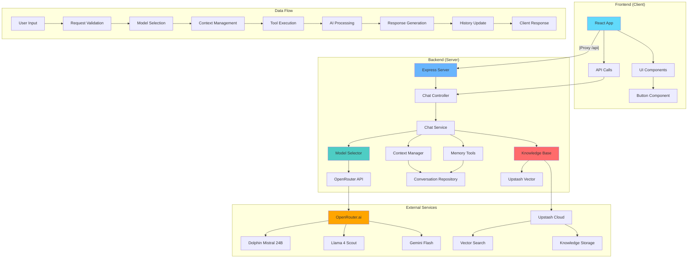
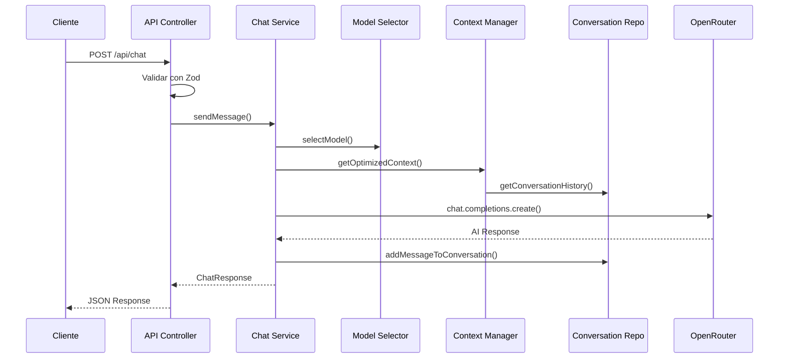

# 🤖 AppAI - Sistema de IA Híbrida Sin Censura

Un sistema completo de inteligencia artificial híbrida con múltiples modelos, herramientas avanzadas y capacidades sin censura, construido con tecnologías modernas para experiencias de conversación completas y sin restricciones.

## 🚀 Características Principales

- **🧠 IA Híbrida Multi-Modelo**: Soporta múltiples modelos de IA con selección automática inteligente
- **🔧 Sistema de Herramientas**: Memoria conversacional, base de conocimiento y herramientas personalizadas
- **💬 Conversaciones Persistentes**: Gestión completa de conversaciones con historial y contexto
- **🌐 Arquitectura Moderna**: Monorepo con cliente React y servidor Express + TypeScript
- **📡 API RESTful Completa**: Endpoints robustos con validación Zod
- **🎨 Interfaz Moderna**: UI construida con React, TailwindCSS y Radix UI
- **🔍 Búsqueda Vectorial**: Integración con Upstash Vector para base de conocimiento
- **⚡ Rendimiento Optimizado**: Selección inteligente de modelos y gestión de contexto

## 📊 Diagrama de Arquitectura



## 🗂️ Estructura del Proyecto

```
appai/
├── 📁 packages/
│   ├── 📁 client/                    # Frontend React + Vite
│   │   ├── 📁 src/
│   │   │   ├── App.tsx               # Componente principal
│   │   │   ├── main.tsx              # Punto de entrada
│   │   │   ├── 📁 components/ui/
│   │   │   │   └── button.tsx        # Componente Button de Radix UI
│   │   │   └── 📁 lib/
│   │   │       └── utils.ts          # Utilidades (tailwind-merge)
│   │   ├── vite.config.ts            # Configuración Vite + Proxy
│   │   ├── components.json           # Configuración shadcn/ui
│   │   └── package.json              # Dependencias cliente
│   └── 📁 server/                    # Backend Express + TypeScript
│       ├── index.ts                  # Servidor principal
│       ├── routes.ts                 # Rutas de la API
│       ├── 📁 controllers/
│       │   └── chat.controller.ts    # Controlador de chat
│       ├── 📁 services/
│       │   ├── chat.service.ts       # Lógica principal de chat
│       │   ├── model-selector.service.ts  # Selección inteligente de modelos
│       │   └── context-manager.service.ts # Gestión de contexto optimizada
│       ├── 📁 repositories/
│       │   └── conversation.repository.ts # Almacenamiento de conversaciones
│       ├── 📁 tools/
│       │   └── memory-tool.example.ts     # Herramienta de memoria
│       ├── 📁 types/
│       │   └── model.types.ts        # Definiciones de tipos
│       ├── 📁 examples/
│       │   └── api-usage.examples.ts # Ejemplos de uso de la API
│       └── package.json              # Dependencias servidor
├── index.ts                          # Launcher concurrente
├── test-automated.js                 # Tests automatizados (Node.js)
├── test-curl.sh                      # Tests con cURL
├── test-frontend.html                # Interface de testing visual
├── insomnia-collection.json          # Colección de Insomnia
├── package.json                      # Configuración workspace raíz
└── README.md                         # Documentación principal
```

## 🛠️ Tecnologías Utilizadas

### Backend

- **Express.js** - Framework web para Node.js
- **OpenAI SDK** - Cliente para APIs de IA con OpenRouter
- **Zod** - Validación de esquemas TypeScript con manejo de errores
- **@upstash/vector** - Base de datos vectorial para conocimiento
- **@upstash/search** - Motor de búsqueda vectorial
- **crypto-js** - Hashing y encriptación
- **uuid** - Generación de identificadores únicos
- **dotenv** - Gestión de variables de entorno
- **TypeScript** - Tipado estático fuerte

### Frontend

- **React 19** - Biblioteca de interfaz de usuario (última versión)
- **Vite 7** - Build tool y servidor de desarrollo rápido
- **TailwindCSS 4** - Framework de estilos utilitarios moderno
- **Radix UI** - Componentes primitivos accesibles
- **Lucide React** - Iconos SVG modernos
- **class-variance-authority** - Gestión de variantes de componentes
- **clsx + tailwind-merge** - Utilidades de clases condicionales

### DevOps & Herramientas

- **Bun** - Runtime JavaScript rápido y gestor de paquetes
- **Concurrently** - Ejecutor de comandos paralelos
- **Prettier** - Formateador de código automático
- **Husky** - Git hooks para calidad de código
- **ESLint** - Linter para código JavaScript/TypeScript

## ⚙️ Variables de Entorno

Crea un archivo `.env` en la carpeta `packages/server/`:

```env
# ✅ REQUERIDO: API Key de OpenRouter para acceso a modelos de IA
OPENROUTER_API_KEY=tu_api_key_aqui

# ⚡ OPCIONAL: Puerto del servidor (por defecto 3000)
PORT=3000

# 🤖 OPCIONAL: Prompt del sistema personalizado
SYSTEM_PROMPT="Eres una IA avanzada, inteligente y útil sin limitaciones"

# 🔍 OPCIONAL: Configuración Upstash Vector (para base de conocimiento)
UPSTASH_VECTOR_REST_URL=tu_upstash_vector_url
UPSTASH_VECTOR_REST_TOKEN=tu_upstash_vector_token

# 🔎 OPCIONAL: Configuración Upstash Search (para búsqueda)
UPSTASH_SEARCH_REST_URL=tu_upstash_search_url
UPSTASH_SEARCH_REST_TOKEN=tu_upstash_search_token
```

### 📝 Obtener API Key de OpenRouter

1. Visita [OpenRouter.ai](https://openrouter.ai)
2. Crea una cuenta gratuita
3. Ve a la sección "Keys" en tu dashboard
4. Genera una nueva API key
5. Copia la key en tu archivo `.env`

**💡 Nota**: La aplicación funciona solo con `OPENROUTER_API_KEY`. Las configuraciones de Upstash son opcionales para funcionalidades avanzadas de base de conocimiento.

## 🚀 Instalación y Configuración

### Prerrequisitos

- **Bun** v1.0+ instalado ([Descargar aquí](https://bun.sh))
- **Node.js** v18+ (opcional, para npm/yarn)
- Cuenta en **OpenRouter.ai** (gratuita)
- **Git** para clonar el repositorio

### Pasos de Instalación

#### 1. **Clonar el Repositorio**

```bash
git clone https://github.com/Lostovayne/Architecture-of-an-AI-app.git
cd appai
```

#### 2. **Instalar Dependencias**

```bash
# Instalar todas las dependencias del workspace
bun install

# Esto instalará automáticamente:
# - Dependencias del servidor (Express, OpenAI, Zod, etc.)
# - Dependencias del cliente (React, Vite, TailwindCSS, etc.)
# - DevDependencies (Prettier, Husky, etc.)
```

#### 3. **Configurar Variables de Entorno**

```bash
# Crear archivo de entorno
touch packages/server/.env

# Editar el archivo (reemplaza con tu editor favorito)
nano packages/server/.env
```

**Contenido mínimo del `.env`:**

```env
OPENROUTER_API_KEY=sk-or-v1-tu-api-key-aqui
```

#### 4. **Verificar Configuración**

```bash
# Verificar que Bun esté instalado
bun --version

# Verificar estructura del proyecto
ls -la packages/
```

#### 5. **Ejecutar en Modo Desarrollo**

```bash
# Ejecutar ambos servicios simultáneamente
bun dev
```

**Esto iniciará:**

- 🖥️ **Frontend**: http://localhost:5173 (Vite dev server)
- 🔧 **Backend**: http://localhost:3000 (Express server)
- 🔄 **Proxy**: Requests `/api/*` → Backend automáticamente

### ✅ Verificación de Instalación

#### Test Rápido del Backend

```bash
# En otra terminal
curl http://localhost:3000/api/chat
# Debería responder: Hello World!
```

#### Test Completo

```bash
# Test de chat simple
curl -X POST http://localhost:3000/api/chat \
  -H "Content-Type: application/json" \
  -d '{
    "prompt": "Hola mundo",
    "conversationId": "550e8400-e29b-41d4-a716-446655440000"
  }'
```

### 🔧 Comandos de Desarrollo

```bash
# 🚀 Desarrollo completo (ambos servicios)
bun dev

# 🔧 Solo servidor (con auto-reload)
cd packages/server && bun dev

# 🌐 Solo cliente (con HMR)
cd packages/client && bun dev

# 📦 Build de producción
bun run build

# 🚀 Iniciar servidor de producción
bun start
```

### 🎨 Comandos de Calidad

```bash
# ✨ Formatear todo el código
bun run format

# 🔍 Lint del cliente
cd packages/client && bun run lint

# 🧹 Fix automático de lint
cd packages/client && bun run lint --fix
```

### 🐛 Troubleshooting Común

#### ❌ Error: "OPENROUTER_API_KEY is not defined"

```bash
# Solución: Verificar el archivo .env
cat packages/server/.env
# Debe contener: OPENROUTER_API_KEY=tu-key-aqui
```

#### ❌ Error: "Port 3000 is already in use"

```bash
# Solución: Cambiar puerto en .env
echo "PORT=3001" >> packages/server/.env
```

#### ❌ Error: "Command 'bun' not found"

```bash
# Instalar Bun
curl -fsSL https://bun.sh/install | bash
# Reiniciar terminal
```

#### ❌ Frontend no carga la API

```bash
# Verificar proxy en vite.config.ts
# Debe apuntar al puerto correcto del servidor
```

### 🔄 Actualización del Proyecto

```bash
# Actualizar dependencias
bun update

# Reinstalar desde cero si hay problemas
rm -rf node_modules packages/*/node_modules bun.lockb
bun install
```

## 📡 API Endpoints Completa

### 🔥 Chat Principal (POST /api/chat)

**Endpoint principal para interacciones con la IA híbrida**

```http
POST /api/chat
Content-Type: application/json

{
  "prompt": "Tu mensaje aquí",
  "conversationId": "uuid-opcional",
  "modelType": "simple|memory|with_tools",
  "taskType": "chat|image|audio|vision",
  "useMemory": true|false,
  "useKnowledgeBase": true|false
}
```

#### 📋 Parámetros de Request

| Parámetro          | Tipo    | Requerido | Valores                            | Descripción                                       |
| ------------------ | ------- | --------- | ---------------------------------- | ------------------------------------------------- |
| `prompt`           | string  | ✅ Sí     | 1-1000 chars                       | El mensaje del usuario                            |
| `conversationId`   | string  | ✅ Sí     | UUID v4                            | ID único de conversación                          |
| `modelType`        | string  | ❌ No     | `simple`, `memory`, `with_tools`   | Tipo de modelo (default: `simple`)                |
| `taskType`         | string  | ❌ No     | `chat`, `image`, `audio`, `vision` | Tipo de tarea (default: `chat`)                   |
| `useMemory`        | boolean | ❌ No     | `true`, `false`                    | Activar memoria conversacional (default: `false`) |
| `useKnowledgeBase` | boolean | ❌ No     | `true`, `false`                    | Activar base de conocimiento (default: `false`)   |

#### 📤 Respuesta Exitosa (200)

```json
{
   "message": "Respuesta generada por la IA",
   "conversationId": "uuid-de-conversacion",
   "modelUsed": "cognitivecomputations/dolphin-mistral-24b-venice-edition:free",
   "toolsUsed": ["retrieveConversationMemory", "addResource"]
}
```

#### ❌ Respuestas de Error

**400 - Error de Validación**

```json
{
   "_errors": [],
   "prompt": {
      "_errors": ["Prompt is required"]
   },
   "conversationId": {
      "_errors": ["Invalid uuid"]
   }
}
```

**500 - Error del Servidor**

```json
{
   "error": "Failed to generate response"
}
```

### 🔍 Health Check (GET /api/chat)

**Verificar que el servidor está funcionando**

```http
GET /api/chat
```

**Respuesta:**

```text
Hello World!
```

## 🤖 Modelos de IA Disponibles

### 📊 Tabla de Comparación de Modelos

| Modelo                   | Provider   | Herramientas | Visión | Streaming | Max Tokens | Uso Recomendado         |
| ------------------------ | ---------- | ------------ | ------ | --------- | ---------- | ----------------------- |
| **Dolphin Mistral 24B**  | OpenRouter | ❌ No        | ❌ No  | ✅ Sí     | 250        | Chat rápido sin censura |
| **Llama 4 Scout**        | OpenRouter | ✅ Sí        | ❌ No  | ✅ Sí     | 400        | Chat con herramientas   |
| **Gemini 2.5 Flash**     | OpenRouter | ❌ No        | ❌ No  | ❌ No     | 0          | Generación de imágenes  |
| **Llama 3.2 11B Vision** | OpenRouter | ✅ Sí        | ✅ Sí  | ✅ Sí     | 500        | Análisis de imágenes    |

### 🎯 Tipos de Modelo (ModelType)

#### 1. `simple` - Chat Básico

- **Modelo**: `cognitivecomputations/dolphin-mistral-24b-venice-edition:free`
- **Características**: Sin herramientas, respuestas rápidas, sin censura
- **Uso**: Conversaciones casuales, respuestas directas
- **Tokens**: 250 max

```json
{
   "prompt": "Explícame qué es React",
   "conversationId": "uuid",
   "modelType": "simple"
}
```

#### 2. `memory` - Chat con Memoria

- **Modelo**: `meta-llama/llama-4-scout:free`
- **Características**: Memoria conversacional, contexto inteligente
- **Uso**: Conversaciones largas que requieren contexto
- **Tokens**: 400 max
- **Herramientas**: Memoria conversacional automática

```json
{
   "prompt": "¿Recuerdas lo que te dije sobre mi trabajo?",
   "conversationId": "uuid",
   "modelType": "memory",
   "useMemory": true
}
```

#### 3. `with_tools` - Chat con Herramientas Completas

- **Modelo**: `meta-llama/llama-4-scout:free`
- **Características**: Todas las herramientas disponibles
- **Uso**: Tareas complejas, aprendizaje, búsqueda
- **Tokens**: 400 max
- **Herramientas**: Memoria + Base de conocimiento

```json
{
   "prompt": "Aprende esto: Next.js 14 incluye App Router",
   "conversationId": "uuid",
   "modelType": "with_tools",
   "useMemory": true,
   "useKnowledgeBase": true
}
```

### 🔧 Herramientas Disponibles

#### 1. **Memoria Conversacional** (`retrieveConversationMemory`)

- **Función**: Busca información específica en el historial de conversación
- **Parámetros**:
   - `query`: Qué buscar ("cuando hablamos de X")
   - `timeframe`: `recent`, `middle`, `beginning`, `all`
- **Activación**: `useMemory: true`

#### 2. **Base de Conocimiento** (`addResource` / `getInformation`)

- **addResource**: Almacena información nueva
- **getInformation**: Busca información almacenada
- **Parámetros**:
   - `resource`: Contenido a almacenar
   - `query`: Búsqueda en la base de conocimiento
- **Activación**: `useKnowledgeBase: true`

### 🚀 Selección Automática de Modelos

El `modelSelectorService` selecciona automáticamente el modelo óptimo basado en:

1. **Tipo de tarea** (`taskType`):
   - `image` → Gemini Flash (futuro)
   - `vision` → Llama Vision (futuro)
   - `chat` → Selección inteligente

2. **Herramientas requeridas**:
   - Sin herramientas → Dolphin Mistral
   - Con herramientas → Llama Scout

3. **Configuración del usuario**:
   - `modelType` especificado
   - `useMemory` / `useKnowledgeBase`

## 🧪 Ejemplos de Uso y Testing

### 1. 🤖 Chat Básico (Dolphin Mistral)

```javascript
// Ejemplo de chat simple y rápido
const response = await fetch('/api/chat', {
   method: 'POST',
   headers: { 'Content-Type': 'application/json' },
   body: JSON.stringify({
      prompt: 'Explícame qué es React en términos simples',
      conversationId: crypto.randomUUID(),
      modelType: 'simple',
   }),
});

const data = await response.json();
console.log(data.message);
// Modelo usado: dolphin-mistral-24b-venice-edition
// Herramientas: []
```

### 2. 🧠 Chat con Memoria Conversacional

```javascript
const conversationId = crypto.randomUUID();

// Establecer información personal
await fetch('/api/chat', {
   method: 'POST',
   headers: { 'Content-Type': 'application/json' },
   body: JSON.stringify({
      prompt: 'Soy Alex, tengo 28 años y soy fullstack developer especializado en Node.js',
      conversationId,
      modelType: 'memory',
      useMemory: true,
   }),
});

// Luego preguntar sobre la información
await fetch('/api/chat', {
   method: 'POST',
   headers: { 'Content-Type': 'application/json' },
   body: JSON.stringify({
      prompt: '¿Podrías resumir mi perfil profesional?',
      conversationId,
      modelType: 'memory',
      useMemory: true,
   }),
});
// La IA recordará la información previa
```

### 3. 📚 Base de Conocimiento

```javascript
// Enseñar información nueva
await fetch('/api/chat', {
   method: 'POST',
   headers: { 'Content-Type': 'application/json' },
   body: JSON.stringify({
      prompt: 'Aprende esto: Vite es un build tool que usa esbuild para pre-bundling rápido',
      conversationId: crypto.randomUUID(),
      modelType: 'with_tools',
      useKnowledgeBase: true,
   }),
});

// Consultar información aprendida
await fetch('/api/chat', {
   method: 'POST',
   headers: { 'Content-Type': 'application/json' },
   body: JSON.stringify({
      prompt: '¿Qué sabes sobre herramientas de build modernas?',
      conversationId: crypto.randomUUID(),
      modelType: 'with_tools',
      useKnowledgeBase: true,
   }),
});
```

### 4. 🎯 Chat Híbrido Completo

```javascript
// Combina memoria + conocimiento + herramientas
await fetch('/api/chat', {
   method: 'POST',
   headers: { 'Content-Type': 'application/json' },
   body: JSON.stringify({
      prompt: 'Basándote en mi perfil y lo que sabes sobre herramientas, ¿debería usar Vite?',
      conversationId: conversationId, // Usa la misma conversación con memoria
      modelType: 'with_tools',
      useMemory: true,
      useKnowledgeBase: true,
   }),
});
// Combina información personal + conocimiento técnico
```

## 🧪 Herramientas de Testing

### 1. 🌐 Frontend Visual (`test-frontend.html`)

```bash
# Abrir en navegador para testing visual interactivo
open test-frontend.html
# o
python -m http.server 8080  # Servir desde localhost
```

**Características:**

- ✅ Interface visual intuitiva
- ✅ Tests de todos los tipos de modelo
- ✅ Respuestas en tiempo real
- ✅ Información de modelo y herramientas usadas

### 2. 🤖 Tests Automatizados (`test-automated.js`)

```bash
# Ejecutar suite completa de tests
node test-automated.js
```

**Tests incluidos:**

- Chat simple con Dolphin Mistral
- Establecimiento y prueba de memoria
- Enseñanza y consulta de conocimiento
- Chat híbrido completo
- Generación de reporte JSON

### 3. ⚡ Tests con cURL (`test-curl.sh`)

```bash
# Ejecutar tests rápidos con cURL
chmod +x test-curl.sh
./test-curl.sh
```

**Características:**

- ✅ Tests rápidos desde terminal
- ✅ Salida formateada con jq
- ✅ UUIDs predefinidos para consistency

### 4. 📬 Colección Insomnia (`insomnia-collection.json`)

```bash
# Importar en Insomnia para testing manual
# File → Import Data → insomnia-collection.json
```

## 🔍 Monitoreo y Debugging

### Logs del Servidor

```bash
# Logs detallados en consola
cd packages/server && bun dev

# Salida esperada:
# 📥 Request recibido: {...}
# ✅ Request validado: {...}
# 🚀 Llamando a chatService...
# 🤖 Modelo seleccionado: dolphin-mistral-24b-venice-edition
# 🔧 Soporta herramientas: false
# ✅ Respuesta exitosa: {...}
```

### Validación de Response

```javascript
// Estructura de respuesta estándar
{
  "message": "Contenido de la respuesta",
  "conversationId": "uuid-v4",
  "modelUsed": "nombre-del-modelo-usado",
  "toolsUsed": ["herramienta1", "herramienta2"] // Array de herramientas ejecutadas
}
```

## 🔒 Consideraciones de Seguridad y Producción

### 🛡️ Seguridad

- ⚠️ **Uso Responsable**: Sistema diseñado para conversaciones libres sin censura
- 🔐 **API Keys**: Nunca commitees tu `OPENROUTER_API_KEY` al repositorio
- � **Gitignore**: El `.env` ya está incluido en `.gitignore`
- �🛡️ **Rate Limiting**: Considera implementar rate limiting en producción
- 📊 **Monitoreo**: Implementa logging y monitoreo para uso en producción
- 🔒 **CORS**: Configura CORS apropiadamente para tu dominio

### 🚀 Despliegue en Producción

#### Preparación para Producción

```bash
# 1. Build del cliente
cd packages/client && bun run build

# 2. Verificar que dist/ se creó correctamente
ls packages/client/dist/

# 3. El servidor sirve automáticamente los archivos estáticos
```

#### Variables de Entorno de Producción

```env
# Producción recomendada
NODE_ENV=production
PORT=3000
OPENROUTER_API_KEY=tu-key-de-produccion

# Opcionales para funcionalidades avanzadas
UPSTASH_VECTOR_REST_URL=tu-url-vector
UPSTASH_VECTOR_REST_TOKEN=tu-token-vector
UPSTASH_SEARCH_REST_URL=tu-url-search
UPSTASH_SEARCH_REST_TOKEN=tu-token-search

# Sistema personalizado
SYSTEM_PROMPT="Tu prompt personalizado de producción"
```

#### Deploy en Vercel/Netlify

```bash
# Configurar como proyecto fullstack
# Frontend: packages/client/
# Backend: packages/server/ (como API)
```

### 📈 Escalabilidad y Performance

#### Optimizaciones Implementadas

- **🧠 Context Management**: Gestión inteligente de contexto para conversaciones largas
- **🔄 Model Selection**: Selección automática del modelo óptimo según la tarea
- **💾 Memory Tools**: Herramientas de memoria eficientes para historial largo
- **⚡ Caching**: Cache de prompts con `prompt_cache_key` en OpenRouter

#### Métricas de Performance

| Modelo          | Tiempo Respuesta Promedio | Tokens/Segundo | Costo por 1K Tokens |
| --------------- | ------------------------- | -------------- | ------------------- |
| Dolphin Mistral | ~2-3 segundos             | ~80-100        | Gratis              |
| Llama Scout     | ~3-5 segundos             | ~60-80         | Gratis              |
| Gemini Flash    | ~1-2 segundos             | N/A            | Gratis              |

## 🌐 Configuración Avanzada

### 🔧 Configuración de Proxy (Vite)

```typescript
// packages/client/vite.config.ts
export default defineConfig({
   server: {
      proxy: {
         '/api': {
            target: 'http://localhost:3000',
            changeOrigin: true,
            secure: false,
         },
      },
   },
});
```

### 🎛️ Configuración del Servidor

```typescript
// packages/server/index.ts
const app = express();

// Middleware personalizado
app.use(express.json({ limit: '10mb' }));
app.use('/api/chat', router);

// Servir archivos estáticos del cliente
app.use(express.static(clientDistPath));

// SPA fallback para React Router
app.use(
   history({
      rewrites: [
         {
            from: /^\/api\/.*$/,
            to: function (context) {
               return context.parsedUrl.pathname;
            },
         },
      ],
   })
);
```

### � Upstash Configuration (Opcional)

Para habilitar la base de conocimiento avanzada:

```bash
# 1. Crear cuenta en Upstash
# 2. Crear Vector Database
# 3. Crear Search Index
# 4. Agregar credentials al .env
```

```env
UPSTASH_VECTOR_REST_URL=https://tu-vector-url.upstash.io
UPSTASH_VECTOR_REST_TOKEN=tu-token-aqui
UPSTASH_SEARCH_REST_URL=https://tu-search-url.upstash.io
UPSTASH_SEARCH_REST_TOKEN=tu-search-token-aqui
```

## 📚 Arquitectura Interna

### 🔄 Flujo de Procesamiento



### 🏗️ Patrón de Servicios

```typescript
// Separación clara de responsabilidades
├── Controllers/     # Manejo de requests HTTP
├── Services/        # Lógica de negocio
├── Repositories/    # Acceso a datos
├── Tools/          # Herramientas de IA
└── Types/          # Definiciones TypeScript
```

## 📋 Esquemas de Validación Completos

### Chat Request Schema (Zod)

```typescript
const chatSchema = z.object({
   prompt: z
      .string()
      .trim()
      .min(1, 'Prompt is required')
      .max(1000, 'Prompt is too long (max 1000 characters)'),
   conversationId: z.uuid('Invalid conversation ID format'),
   modelType: z.nativeEnum(ModelType).optional().default(ModelType.SIMPLE),
   taskType: z.nativeEnum(TaskType).optional().default(TaskType.CHAT),
   useMemory: z.boolean().optional().default(false),
   useKnowledgeBase: z.boolean().optional().default(false),
});
```

### TypeScript Interfaces

```typescript
// Tipos de modelos
export enum ModelType {
   SIMPLE = 'simple',
   WITH_TOOLS = 'with_tools',
   MEMORY = 'memory',
}

// Tipos de tareas
export enum TaskType {
   CHAT = 'chat',
   IMAGE = 'image',
   AUDIO = 'audio',
   VISION = 'vision',
}

// Request completa
export interface ChatRequest {
   prompt: string;
   conversationId: string;
   modelType?: ModelType;
   taskType?: TaskType;
   useMemory?: boolean;
   useKnowledgeBase?: boolean;
}

// Response completa
export interface ChatResponse {
   id: string;
   message: string;
   modelUsed: string;
   toolsUsed?: string[];
   conversationId: string;
}

// Configuración de modelo
export interface ModelConfig {
   name: string;
   provider: 'openrouter' | 'openai' | 'anthropic' | 'custom';
   supports: {
      tools: boolean;
      vision: boolean;
      streaming: boolean;
   };
   maxTokens: number;
   costPer1KTokens?: number;
}
```

## 📊 Estructura de Datos y Storage

### Conversation Repository

```typescript
// Storage en memoria (Map)
const conversations = new Map<
   string,
   Array<{ role: 'user' | 'assistant' | 'system'; content: string }>
>();

// Métodos disponibles
export const conversationRepository = {
   addMessageToConversation(conversationId: string, message: Message): void,
   getConversationHistory(conversationId: string): Message[],
};
```

### Memory Tool Data Structure

```typescript
// Resultado de búsqueda en memoria
interface MemorySearchResult {
   found: boolean;
   message: string;
   context?: string;
   timeframe: 'recent' | 'middle' | 'beginning' | 'all';
   totalMessages: number;
}
```

## 🔄 Changelog y Actualizaciones

### Versión Actual (v1.0.0)

#### ✨ Características Principales

- ✅ Sistema híbrido multi-modelo (Dolphin Mistral + Llama Scout)
- ✅ Herramientas de memoria conversacional avanzada
- ✅ Base de conocimiento con Upstash Vector
- ✅ Selección automática inteligente de modelos
- ✅ Gestión optimizada de contexto para conversaciones largas
- ✅ API RESTful completa con validación Zod
- ✅ Frontend React moderno con TailwindCSS
- ✅ Tests automatizados y herramientas de desarrollo

#### 🔧 Mejoras Técnicas

- ✅ TypeScript en todo el stack
- ✅ Workspace monorepo con Bun
- ✅ Hot reloading para desarrollo
- ✅ Proxy automático frontend/backend
- ✅ Logging detallado para debugging

#### 🧪 Herramientas de Testing

- ✅ Suite de tests automatizados (Node.js)
- ✅ Tests con cURL para terminal
- ✅ Interface visual para testing (HTML)
- ✅ Colección Insomnia para API testing

### 🚀 Próximas Actualizaciones (Roadmap)

#### v1.1.0 - Modelos Multimodales

- 🔮 Soporte completo para Llama Vision
- 🔮 Generación de imágenes con Gemini Flash
- 🔮 Procesamiento de audio y voz
- 🔮 Upload y análisis de archivos

#### v1.2.0 - Persistencia Avanzada

- 🔮 Base de datos PostgreSQL/MongoDB
- 🔮 Sistema de usuarios y autenticación
- 🔮 Conversaciones compartidas
- 🔮 Exportación de conversaciones

#### v1.3.0 - Features Avanzadas

- 🔮 Streaming de respuestas en tiempo real
- 🔮 Rate limiting inteligente
- 🔮 Dashboard de analytics
- 🔮 Plugin system para herramientas custom

### 📝 Notas de Migración

Si actualizas desde una versión anterior:

1. **Variables de entorno**: Nuevas variables opcionales para Upstash
2. **API**: Nuevos parámetros opcionales (backward compatible)
3. **Dependencies**: Ejecutar `bun install` para nuevas dependencias

## 🤝 Contribuciones y Desarrollo

### 🔧 Setup para Contribuidores

```bash
# 1. Fork del repositorio
git clone https://github.com/tu-usuario/Architecture-of-an-AI-app.git
cd appai

# 2. Crear rama para feature
git checkout -b feature/nueva-funcionalidad

# 3. Instalar dependencias
bun install

# 4. Configurar git hooks
bun prepare

# 5. Ejecutar tests
node test-automated.js
```

### 📋 Guidelines de Contribución

1. **Code Style**: Usar Prettier para formateo automático
2. **Commits**: Seguir conventional commits (`feat:`, `fix:`, `docs:`)
3. **Testing**: Agregar tests para nuevas funcionalidades
4. **TypeScript**: Mantener tipado fuerte sin `any`
5. **Documentation**: Actualizar README para cambios de API

### 🐛 Reportar Issues

Template para reportar bugs:

```markdown
**Descripción del bug**
Descripción clara del problema

**Pasos para reproducir**

1. Ir a '...'
2. Hacer click en '....'
3. Ver error

**Comportamiento esperado**
Lo que debería suceder

**Screenshots**
Si es aplicable

**Entorno:**

- OS: [Windows/Mac/Linux]
- Bun version: [ejecutar `bun --version`]
- Node version: [ejecutar `node --version`]
```

### 🌟 Contributors

- **Lostovayne** - Autor original y mantenedor principal
- Open for contributions! �

## �📄 Licencia y Legal

Este proyecto está bajo la **Licencia MIT**. Ver archivo `LICENSE` para detalles completos.

### ⚖️ Resumen de la Licencia MIT

- ✅ **Uso comercial** permitido
- ✅ **Modificación** permitida
- ✅ **Distribución** permitida
- ✅ **Uso privado** permitido
- ❌ **Sin garantía** incluida
- ❌ **Sin responsabilidad** del autor

### 🔒 Disclaimer de Uso

Este sistema de IA está diseñado para conversaciones libres sin censura. Los usuarios son responsables del contenido generado y deben usar la herramienta de manera ética y legal según las leyes de su jurisdicción.

### 🏷️ Atribuciones

- **OpenRouter.ai** - Proveedor de modelos de IA
- **Upstash** - Servicios de base de datos vectorial
- **Radix UI** - Componentes de interface
- **TailwindCSS** - Framework de estilos
- **React Team** - Biblioteca de UI
- **Bun Team** - Runtime y herramientas

---

## 👨‍💻 Información del Autor

**Lostovayne**

- 🐙 GitHub: [@Lostovayne](https://github.com/Lostovayne)
- 📧 Issues: [Reportar problema](https://github.com/Lostovayne/Architecture-of-an-AI-app/issues)
- 🌟 Stars: ¡Dale una estrella si te gustó el proyecto!

---

<div align="center">

⚡ **Construido con tecnologías modernas para conversaciones de IA sin límites** ⚡

[](https://github.com/Lostovayne)
[](https://www.typescriptlang.org/)
[](https://reactjs.org/)
[](https://bun.sh/)

</div>
